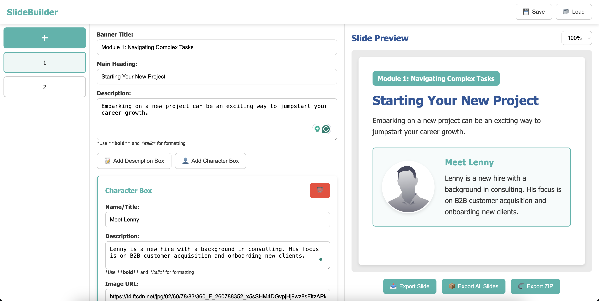

# LMS Slide Builder

A professional-grade slide builder for creating consistent training materials for Learning Management Systems (LMS).



## 🚀 Overview

SlideBuilder is a specialized content management system designed for teams that need to create professional, consistent training materials for educational purposes. It helps subject matter experts create well-structured, visually appealing slides without requiring design expertise.

### Key Features

- **Easy-to-use Interface**: Intuitive drag-and-drop interface for quick slide creation
- **Consistent Design**: Pre-designed templates ensure brand consistency
- **Rich Content Types**: Support for text, formatting, and character/avatar boxes
- **Export Options**: Export individual slides, all slides, or a complete package
- **Save & Load Projects**: Save your work and continue later
- **Responsive Design**: Works on desktop and tablet devices
- **Auto-save**: Prevents work loss with automatic saving

## 🛠️ Tech Stack

SlideBuilder is built using modern web technologies:

- **Frontend**: 
  - Vanilla JavaScript (ES6+)
  - HTML5
  - CSS3 with custom properties and flexbox layout

- **Build Tools**:
  - Webpack 5 for bundling
  - Babel for JavaScript transpilation
  - CSS optimization and minification

- **Libraries**:
  - FileSaver.js for file downloads
  - JSZip for creating ZIP archives

- **Development**:
  - Webpack Dev Server for local development
  - Hot Module Replacement for faster iteration

## 🏗️ Project Structure

The application follows a modular architecture:

```
src/
├── css/
│   └── styles.css       # Main styles
├── js/
│   ├── index.js         # Application entry point
│   └── modules/         # Modular JavaScript components
│       ├── SlideManager.js    # Manages slides collection
│       ├── FormBuilder.js     # Builds form UI
│       ├── PreviewRenderer.js # Renders slide previews
│       ├── ExportManager.js   # Handles exports
│       ├── StorageManager.js  # Manages saving/loading
│       └── Toast.js           # UI notifications
├── index.html           # Main HTML template
```

## 💻 How It Works

SlideBuilder operates as a single-page application with these core components:

1. **Slide Management**: Create, edit, and reorder slides using a visual interface
2. **Form Builder**: Dynamic form generation for different content types
3. **Live Preview**: Real-time preview of slides as you edit
4. **Storage**: Local and file-based storage for projects
5. **Export Engine**: Generates standalone HTML slides ready for LMS integration

### User Workflow

1. Create a new slide
2. Add a banner title, main heading, and description
3. Add content boxes (descriptions, character boxes, etc.)
4. Preview the slide in real-time
5. Reorder slides using drag and drop
6. Export slides individually or as a package
7. Save projects for future editing

## 🚀 Getting Started

### Prerequisites

- Node.js 14.x or higher
- npm 7.x or higher

### Installation

1. Clone the repository:
   ```bash
   git clone https://github.com/yourusername/slide-builder.git
   cd slide-builder
   ```

2. Install dependencies:
   ```bash
   npm install
   ```

3. Start the development server:
   ```bash
   npm run dev
   ```

4. Build for production:
   ```bash
   npm run build
   ```

5. Serve the production build:
   ```bash
   npm start
   ```

## 📈 Use Cases

SlideBuilder is ideal for:

- **Corporate Training Teams**: Create consistent training materials
- **Educational Institutions**: Build engaging course content
- **Instructional Designers**: Standardize course assets
- **Subject Matter Experts**: Create professional materials without design skills
- **L&D Departments**: Maintain consistent branding across learning content

## 🌟 Future Enhancements

Planned features for future releases:

- Rich text editor with more formatting options
- Additional slide templates and themes
- Collaborative editing
- Cloud storage integration
- PDF export option
- Image upload and management
- Interactive elements for slides
- Analytics on slide usage and engagement

## 📄 License

This project is licensed under the MIT License - see the LICENSE file for details.

---

Built with ❤️ as an internal tool for creating professional training materials.
